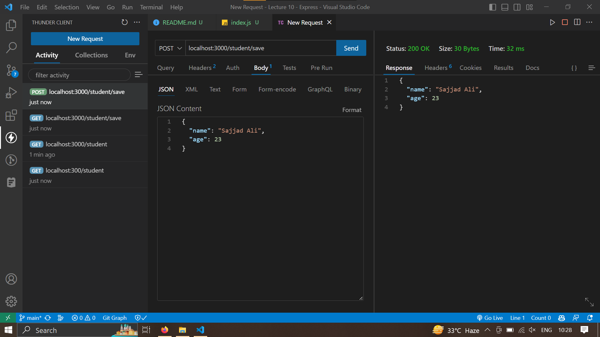

# Installing Express

```sh
yarn init
yarn add express
```

Dependencies and dev dependencies

# Basic express app

```js
const express = require("express");
const app = express();

app.get("/", (req, res) => {
  res.send("Hello World!");
});

app.get("/about", (req, res) => {
  res.send("About");
});

app.listen(3000, () => console.log("Server running on port 3000"));
```

# Sending html files

```js
const express = require("express");
const path = require("path");
const app = express();

app.get("/", (req, res) => {
  res.sendFile(path.join(__dirname, "public", "index.html"));
});

app.get("/about", (req, res) => {
  res.sendFile(path.join(__dirname, "public", "about.html"));
});

app.get("*", (req, res) => {
  res.sendFile(path.join(__dirname, "public", "404.html"));
});

app.listen(3000, () => console.log("Server running on port 3000"));
```

# Sending data

```js
app.get("/student", (req, res) => {
  res.send({ name: "John", age: 23, city: "New York" });
});
```

```js
app.get("/student", (req, res) => {
  res.json({ name: "John", age: 23, city: "New York" });
});
```

# Express with Body parser

```js
const express = require("express");
const path = require("path");
const bodyParser = require("body-parser");
const app = express();

app.use(bodyParser.json());

app.get("/", (req, res) => {
  res.sendFile(path.join(__dirname, "public", "index.html"));
});

app.get("/about", (req, res) => {
  res.sendFile(path.join(__dirname, "public", "about.html"));
});

app.get("/student", (req, res) => {
  res.json({ name: "John", age: 23, city: "New York" });
});

app.post("/student/save", (req, res) => {
  console.log(req.body);
  res.json(req.body);
});

app.get("*", (req, res) => {
  res.sendFile(path.join(__dirname, "public", "404.html"));
});

app.listen(3000, () => console.log("Server running on port 3000"));
```



# Discussion on CI/CD Pipeline

# Nodemon

Automatically restarts the server when changes are made to the code base and saved.

```sh
yarn add nodemon --dev
```

Add this script into package.json

```json
"scripts": {
    "start": "nodemon index.js"
  },
```

```sh
yarn start
```

# Template Engine

[EJS](https://ejs.co/#install)

```sh
yarn add ejs
```

Html file should have ejs exts
All file should be in viwes folder

`index.js`

```js
const express = require("express");
const bodyParser = require("body-parser");

const app = express();
app.use(bodyParser.json());
app.set("view engine", "ejs");

app.get("/", (req, res) => {
  res.render("index", { title: "Home" });
});

app.listen(3000, () => {
  console.log("Server is running on port 3000.");
});
```

`index.ejs` in view

```html
<!DOCTYPE html>
<html lang="en">
  <head>
    <meta charset="UTF-8" />
    <meta name="viewport" content="width=device-width, initial-scale=1.0" />
    <title>About</title>
  </head>

  <body>
    <h1>Hello World</h1>
    <h3><%=title%></h3>
  </body>
</html>
```

## Populating list using EJS

`index.js`

```js
app.get("/products", (req, res) => {
  const products = [
    { id: 1, name: "Product 1", price: 1000 },
    { id: 2, name: "Product 2", price: 2000 },
    { id: 3, name: "Product 3", price: 3000 },
    { id: 4, name: "Product 4", price: 4000 },
    { id: 5, name: "Product 5", price: 5000 },
  ];
  res.render("products", { title: "Products", products: products });
});
```

`products.ejs`

```html
<!DOCTYPE html>
<html lang="en">
<head>
    <meta charset="UTF-8">
    <meta name="viewport" content="width=device-width, initial-scale=1.0">
    <title>Document</title>
</head>
<body>
    <h1>
        <%=title%>
    </h1>
    <ul>
        <% for(let i=0; i<products.length; i++) { %>
            <li>
                <%= products[i].name %> - $<%= products[i].price %>
            </li>
            <% } %>
    </ul>
</body>
</html>
```

## Including component

`navbar.ejs`

```html
<ul>
  <li><a href="/">Home</a></li>
  <li><a href="/products">Products</a></li>
</ul>
```

`index.ejs`

```html
<!DOCTYPE html>
<html lang="en">
  <head>
    <meta charset="UTF-8" />
    <meta name="viewport" content="width=device-width, initial-scale=1.0" />
    <title>About</title>
  </head>

  <body>
    <%-include("navbar")%>
    <h1>Hello World</h1>
    <h3><%=title%></h3>
  </body>
</html>
```

`products.ejs`

```html
<!DOCTYPE html>
<html lang="en">

<head>
    <meta charset="UTF-8">
    <meta name="viewport" content="width=device-width, initial-scale=1.0">
    <title>Document</title>
</head>

<body>
    <%-include("navbar")%>
    <h1>
      <%=title%>
      </h1>
      <ul>
        <% for(let i=0; i<products.length; i++) { %>
          <li>
            <%= products[i].name %> - $<%= products[i].price %>
          </li>
        <% } %>
    </ul>
</body>
</html>
```
